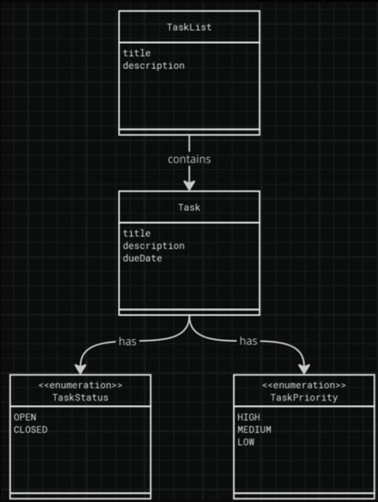
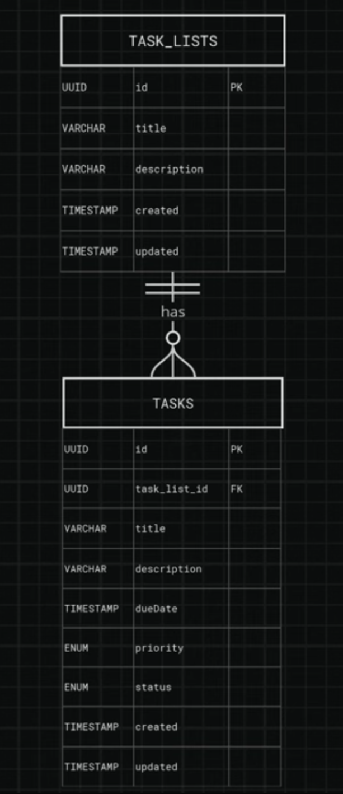
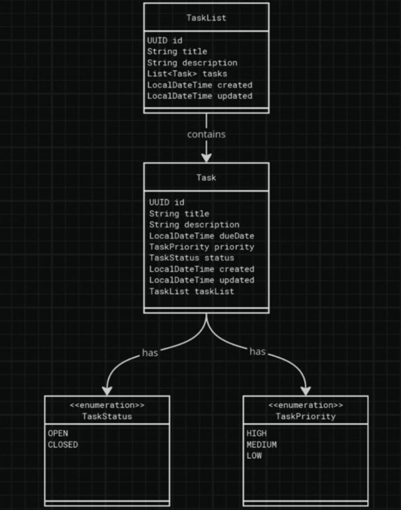

# 📝 Task Tracker

Ein produktivitätssteigerndes Task-Management-Tool zur Organisation von Aufgaben in Task-Listen – entwickelt mit Java, Spring Boot, Node.js, Maven und Docker.

## 📌 Projektübersicht

Die Task Tracker App hilft Nutzern, tägliche Aufgaben zu organisieren, Prioritäten zu setzen und Fortschritt zu verfolgen. Die Anwendung bietet eine benutzerfreundliche Oberfläche zum Erstellen, Verwalten und Abschließen von Aufgaben.

## 👨‍💻 Domaindiagramm


## 🗃️ Entity-Relationship-Diagramm (ERD)


## 👨‍💻 Klassendiagramm


# ✅ User Stories & Akzeptanzkriterien

## 🗂️ Group Tasks into Task Lists

Als Projektmanager
möchte ich mehrere Task-Listen für verschiedene Projekte erstellen,
damit ich Aufgaben organisiert und getrennt halten kann.

**Akzeptanzkriterien:**
- Ein Benutzer kann Task-Listen erstellen, die Aufgaben enthalten.
- Jede Task-Liste hat einen Titel und optional eine Beschreibung.

## ✏️ Update Task Lists

Als Projektmanager
möchte ich den Namen einer Task-Liste aktualisieren,
um sicherzustellen, dass sie relevant bleibt.

**Akzeptanzkriterien:**
- Ein Benutzer kann den Namen und die Beschreibung einer Task-Liste aktualisieren.

## 🗑️ Delete Task Lists

Als Projektmanager
möchte ich überflüssige oder versehentlich erstellte Task-Listen löschen,
um Ordnung zu halten.

**Akzeptanzkriterien:**
- Ein Benutzer kann Task-Listen löschen.

## ➕ Capture Tasks

Als vielbeschäftigter Profi
möchte ich neue Aufgaben schnell zu einer Liste hinzufügen,
um nichts zu vergessen und trotzdem fokussiert zu bleiben.

**Akzeptanzkriterien:**
- Benutzer können neue Aufgaben zu einer Task-Liste hinzufügen.
- Jede Aufgabe enthält: Titel, optionale Beschreibung, Fälligkeitsdatum und Priorität.

## 🌟 Bonus Features (Optionale Erweiterungen)

- Erinnerungen für wichtige Aufgaben
- Filter-/Sortierfunktionen nach Fälligkeitsdatum, Priorität oder Liste
- Dashboard mit Abschluss-Statistiken
- Globale Suchfunktion für Aufgaben
- Tagging-System für Aufgaben
- Teilen von Listen oder Aufgaben mit anderen Nutzern
- Kalenderintegration zur Synchronisation
- Pomodoro-Timer zur Konzentrationsförderung
- Gamification-System mit Punkten & Erfolgen

## 📚 Fachliche Definitionen

**Task**
Eine spezifische Handlung oder ein To-do, das abgeschlossen werden soll. Enthält Titel, Beschreibung, Fälligkeitsdatum, Priorität.

**Task List**
Eine Sammlung zusammengehöriger Aufgaben, z. B. „Arbeit", „Einkaufen", „Projekt X".

## 🚀 Projekt-Setup & Entwicklungsschritte

✅ Entwicklungsumgebung eingerichtet
✅ Projektbeschreibung analysiert
✅ Anwendung entworfen (Domainmodell, Klassen, ERD)
✅ Datenbank gestartet & verbunden
✅ Domainklassen erstellt
✅ DTOs definiert
✅ Mapper implementiert
✅ Repositories angelegt
✅ REST API + Fehlerbehandlung entwickelt
✅ Datenbank-Transaktionen implementiert
✅ Test-Driven Development (TDD) implementiert
✅ Unit-Tests mit Mockito erstellt

## 🧪 Tests & Testmethodik

### 📋 Testübersicht

Das Projekt implementiert eine umfassende Teststrategie mit verschiedenen Testebenen:

```
    🔺 End-to-End Tests (geplant)
   ────────────────────────────────
  🔺🔺 Integrationstests (H2 Database)
 ──────────────────────────────────────
🔺🔺🔺 Unit-Tests (Mockito & TDD)
```

### 🎯 Test-Driven Development (TDD)

**Was ist TDD?**
Test-Driven Development folgt dem **Red-Green-Refactor** Zyklus:

1. **🔴 RED**: Schreibe einen fehlschlagenden Test
2. **🟢 GREEN**: Schreibe minimalen Code, um den Test zu bestehen
3. **🔵 REFACTOR**: Verbessere den Code bei gleichbleibenden Tests

**TDD-Implementierung:**
```java
// Beispiel: TaskServiceImplTDDTest.java
@Test
void updateTask_ShouldUpdateTaskSuccessfully_WhenTaskExists() {
    // Arrange: Test-Setup
    when(taskRepository.findByTaskListIdAndId(taskListId, taskId))
        .thenReturn(Optional.of(existingTask));
    
    // Act: Methode ausführen
    Task result = taskService.updateTask(taskListId, taskId, updatedTaskData);
    
    // Assert: Ergebnis prüfen
    assertEquals("Updated Title", result.getTitle());
    verify(taskRepository, times(1)).save(existingTask);
}
```

### 🔬 Unit-Tests (Mockito)

**Implementierte Tests:**

#### TaskServiceImplTest.java (Mockito Unit-Tests)
- ✅ `createTask_ShouldCreateTaskSuccessfully`
- ✅ `createTask_ShouldThrowException_WhenTaskAlreadyHasId`
- ✅ `createTask_ShouldThrowException_WhenTitleIsNull`
- ✅ `createTask_ShouldThrowException_WhenTaskListNotFound`
- ✅ `deleteTask_ShouldDeleteTaskSuccessfully`
- ✅ `listTasks_ShouldReturnTasksSuccessfully`

#### TaskServiceImplTDDTest.java (TDD Unit-Tests)
- ✅ `updateTask_ShouldUpdateTaskSuccessfully_WhenTaskExists`
- ✅ `updateTask_ShouldThrowException_WhenTaskNotFound`
- ✅ `updateTask_ShouldThrowException_WhenTitleIsBlank`
- ✅ `updateTask_ShouldThrowException_WhenTitleIsNull`

**Testmerkmale:**
- **Isolation**: Mocks für Repository-Dependencies
- **Schnell**: Keine echten Datenbankzugriffe
- **Präzise**: Tests nur die Business-Logik
- **Umfassend**: Erfolgs- und Fehlerfälle abgedeckt

### 🗃️ Integrationstests (H2 Database)

**Konfiguration:**
```java
@DataJpaTest
@Import(TaskServiceImpl.class)
class TaskServiceImplIntegrationTest {
    // Tests mit echter H2-Datenbank
}
```

**Was wird getestet:**
- Datenpersistierung
- Repository-Methoden
- JPA-Entity-Mappings
- Transaktionsverhalten

### 🛠️ Tests ausführen

**Alle Tests:**
```bash
./mvnw test
```

**Spezifische Testklasse:**
```bash
./mvnw test -Dtest=TaskServiceImplTDDTest
```

**Spezifische Testmethode:**
```bash
./mvnw test -Dtest=TaskServiceImplTDDTest#updateTask_ShouldUpdateTaskSuccessfully_WhenTaskExists
```

### 📊 Testabdeckung

**Getestete Funktionalitäten:**
- ✅ Task erstellen (`createTask`)
- ✅ Task aktualisieren (`updateTask`) - **TDD implementiert**
- ✅ Task löschen (`deleteTask`)
- ✅ Tasks auflisten (`listTasks`)
- ✅ Task abrufen (`getTask`)

**Getestete Szenarien:**
- ✅ Erfolgreiche Operationen
- ✅ Eingabevalidierung (null/leere Werte)
- ✅ Fehlerbehandlung (Entity nicht gefunden)
- ✅ Geschäftslogik (Prioritäts-Defaults, Status-Management)

### 🎓 Testvorteile

**TDD-Vorteile:**
- **Design-Qualität**: Tests beeinflussen die API-Gestaltung
- **Dokumentation**: Tests als lebende Spezifikation
- **Regression**: Schutz vor zukünftigen Fehlern
- **Vertrauen**: Code funktioniert bereits vor der Implementierung

**Mockito-Vorteile:**
- **Isolation**: Unabhängig von externen Dependencies
- **Kontrolle**: Präzise Kontrolle über Testszenarien
- **Performance**: Schnelle Testausführung

- ## 🔒 OWASP Sicherheit & Best Practices

Dieses Projekt implementiert wichtige Sicherheitsrichtlinien basierend auf den **OWASP Top 10** Web Application Security Risks.

### 🛡️ Implementierte OWASP-Sicherheitsmaßnahmen

#### 1. **A01:2021 – Broken Access Control** ✅
**Problem:** Unzureichende Zugriffskontrolle ermöglicht unbefugten Datenzugriff.

**Unsere Lösung:**
- **JWT-Token-basierte Authentifizierung** mit Spring Security
- **Benutzer-spezifische Datenfilterung** in allen Controllern
- **@PreAuthorize Annotationen** für Methodenebene-Sicherheit

```java
@GetMapping
public List<TaskListDto> listTaskLists(Authentication authentication) {
    String username = authentication.getName(); // JWT-Username extrahieren
    return taskListService.listTaskListsByUsername(username); // Nur eigene Daten
}
```

#### 2. **A02:2021 – Cryptographic Failures** ✅
**Problem:** Schwache Verschlüsselung oder unverschlüsselte sensible Daten.

**Unsere Lösung:**
- **BCrypt-Passwort-Hashing** mit Spring Security
- **HTTPS-ready Konfiguration** für Produktionsumgebung
- **JWT-Token-Signierung** mit sicherem Secret

```java
@Bean
public PasswordEncoder passwordEncoder() {
    return new BCryptPasswordEncoder(12); // Starke Verschlüsselung
}
```

#### 3. **A03:2021 – Injection** ✅
**Problem:** SQL, NoSQL oder Command Injection durch unsichere Eingabeverarbeitung.

**Unsere Lösung:**
- **JPA/Hibernate ORM** verhindert SQL-Injection automatisch
- **Spring Data Repository Pattern** mit typsicheren Queries
- **@Valid Annotationen** für Eingabevalidierung

```java
// Sichere Repository-Methode (kein Raw SQL)
List<TaskList> findByUserUsernameOrderByCreatedDesc(String username);

// Controller-Validierung
public TaskListDto createTaskList(@Valid @RequestBody TaskListDto taskListDto) {
    // Spring validiert automatisch
}
```

#### 4. **A05:2021 – Security Misconfiguration** ✅
**Problem:** Unsichere Standard-Konfigurationen oder fehlende Sicherheits-Headers.

**Unsere Lösung:**
- **CORS-Konfiguration** für sichere Cross-Origin-Requests
- **Spring Security Filterchain** mit expliziten Regeln
- **Produktions-Profile** mit gehärteten Einstellungen

```java
@Bean
public SecurityFilterChain filterChain(HttpSecurity http) throws Exception {
    return http
        .cors(cors -> cors.configurationSource(corsConfigurationSource()))
        .csrf(csrf -> csrf.disable()) // API-spezifisch
        .authorizeHttpRequests(auth -> auth
            .requestMatchers("/api/auth/**").permitAll()
            .anyRequest().authenticated()) // Alles andere geschützt
        .build();
}
```

#### 5. **A07:2021 – Identification and Authentication Failures** ✅
**Problem:** Schwache Authentifizierung oder Session-Management-Schwächen.

**Unsere Lösung:**
- **Stateless JWT-Authentication** (keine Session-Hijacking)
- **Token-Expiration** mit konfigurierbarer Lebensdauer
- **Sichere Logout-Funktionalität** mit Token-Invalidierung

```java
// JWT-Token mit Expiration
private String createToken(String username) {
    return Jwts.builder()
        .setSubject(username)
        .setIssuedAt(new Date())
        .setExpiration(new Date(System.currentTimeMillis() + 86400000)) // 24h
        .signWith(getSigningKey(), SignatureAlgorithm.HS512)
        .compact();
}

// Frontend Token-Management
const logout = () => {
    localStorage.clear(); // Token sicher entfernen
    delete axios.defaults.headers.common['Authorization'];
};
```

### 🔧 Zusätzliche Sicherheitsmaßnahmen

**Input Validation:**
- Bean Validation (@NotNull, @NotBlank, @Email)
- TypeScript-Typsicherheit im Frontend
- Automatische XSS-Schutz durch React

**Error Handling:**
- Keine sensiblen Informationen in Error-Messages
- Standardisierte HTTP-Status-Codes
- Logging ohne sensible Daten

**Database Security:**
- Prepared Statements durch JPA
- Benutzer-isolierte Datenbank-Queries
- PostgreSQL mit beschränkten Benutzerrechten

### 📊 Sicherheits-Checkliste

- ✅ **Authentifizierung & Autorisierung** (JWT + Spring Security)
- ✅ **Passwort-Sicherheit** (BCrypt-Hashing)
- ✅ **SQL-Injection-Schutz** (JPA/Hibernate)
- ✅ **CORS-Konfiguration** (Sichere Cross-Origin-Requests)
- ✅ **Input-Validierung** (Bean Validation + TypeScript)
- ✅ **Fehlerbehandlung** (Keine Information-Leakage)
- ✅ **Session-Management** (Stateless JWT)
- ✅ **Benutzer-Daten-Isolation** (User-spezifische Queries)


## 🧰 Technologien

### Backend
- **Java 21**
- **Spring Boot 3.3.5**
- **Maven** (Build-Management)
- **PostgreSQL** (Produktions-Datenbank via Docker)
- **H2 Database** (Test-Datenbank)
- **JPA/Hibernate** (ORM)

### Frontend
- **React 18**
- **TypeScript**
- **Vite** (Build-Tool)
- **Node.js**

### Testing
- **JUnit 5** (Test-Framework)
- **Mockito** (Mocking-Framework)
- **Spring Boot Test** (Integrationstests)
- **AssertJ** (Fluent Assertions)

### DevOps
- **Docker** (Containerisierung)
- **Maven Wrapper** (Build-Konsistenz)
- **Git** (Versionskontrolle)

## 🚀 Entwicklung & Deployment

### Lokale Entwicklung
```bash
# Backend starten
./mvnw spring-boot:run

# Frontend starten
npm install
npm run dev

# Tests ausführen
./mvnw test
```

### Docker Deployment
```bash
# Datenbank starten
docker-compose up -d

# Anwendung bauen
./mvnw clean package

# Docker Image erstellen
docker build -t task-tracker .
```

---

**Entwickelt mit ❤️ und Test-Driven Development**
